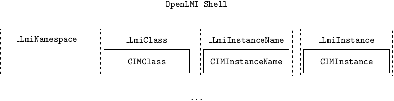

Structure
=========
OpenLMI Shell is based on a python interpreter and added logic, therefore what
you can do in pure python, it is possible in OpenLMI Shell. There are classes
added to manipulate with CIM classes, instance names, instances, etc.
Additional classes are added to fulfill wrapper pattern and expose only those
methods, which are necessary for the purpose of a shell. Following scheme
depicts a structure of the OpenLMI Shell.

